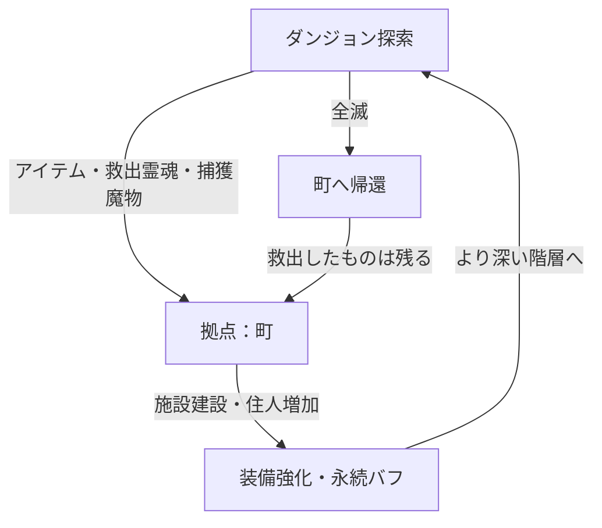

# ゲーム企画書：(タイトル未定) — 町作り×2Dローグライク

## 1. コンセプト・概要
**「ダンジョンから持ち帰ったすべてが、町の力になる。」**

不思議のダンジョン風のターン制探索と、拠点となる町を少しずつ作り上げていく育成要素を組み合わせた、スマホ向け一人用ローグライトゲームです。

- **ジャンル**: 町育成ローグライト（ターン制ダンジョン探索）
- **ターゲット**: 自分のペースでコツコツと進行を楽しみたい一人用ゲーム愛好家
- **プラットフォーム**: スマートフォン（横持ち画面）

## 2. メインループ

## 3. 町作りシステム（拠点発展）
プレイヤーはダンジョンから持ち帰った「素材」や「救出した霊魂」「魔物」を使って、廃れた拠点を再建・復興します。

- **施設建設**:
    - **鍛冶屋**: 武器・防具の強化、合成（強化時にミニゲーム要素あり）。
    - **商店**: アイテムの売買。町の規模に合わせて品揃えが改善。
    - **宿屋 / ギルド**: スタミナ回復やクエストの受注。特定のクエストで職業レベルの上限が解放される。
    - **畑 / 釣り堀 / 牧場**: ダンジョン探索や拠点活動に不可欠な活動エネルギー（霊素）を得るための「食料」を生産・獲得するスローライフ施設。
    - **魔物牧場**: ダンジョンで連れ戻した魔物を収容。
- **救出した霊魂たち**: 依り代となる鎧や人形に憑依して町の住人となり、特定の施設に配置することでボーナスが発生します。
- **連れ戻した魔物**: 町の労働力（資源生産）として使うか、ダンジョンへ「ペット」として連れて行くかを選べます。

## 4. ダンジョンシステム
- **ターン制・シームレス戦闘**: プレイヤーが一歩行動すると敵も行動するシステム。「風来のシレン」のように、専用の戦闘画面には移行せず、マップ上でそのまま戦闘が行われます。
- **フロア生成**: 潜るたびに地形、落ちているアイテム、敵の配置が変わる自動生成マップ。
- **空腹度（霊素）システム**: ダンジョン内での無限稼ぎを防ぎ、現世に留まるエネルギーを管理するシステム。町で作った食料から生命力を光として吸収し、スタミナをしのぎます。
- **地形・ギミック**: 罠や、特定の素材が得られる採取ポイント、強力なボスが待ち構える階層。

## 5. 開発環境・ビジュアル・操作
- **開発環境**: Unity
- **ビジュアル（グラフィック）**: ドット絵ではなく、素材を活かした表現。（※要検討事項ではあるが）拠点の町は「完全な2D」、探索するダンジョン内は「2Dと3Dを交えた表現（例：背景が3Dでキャラクターが2Dなど）」を想定。
- **画面構成**: スマホ横画面。中央にメイン画面、左右や下部にコマンドボタンなどを配置。
- **操作**: 十字キーUIまたはタップ移動を選択可能にする。

---

## 検討中事項（オープンな質問）

- **タイトル案**:
    1. 『迷宮の村：再建記』
    2. 『ダンジョン・タウン・クロニクル』
    3. 『お持ち帰り！不思議のダンジョン』
- **魔物の役割**: 捕まえた魔物は「町限定の労働力」にするか、それとも「ダンジョンでの共闘」をメインにするか。
- **職業・クラスシステム**: どの程度のバリエーションを持たせるか。上級職への転職条件のバランス調整。
