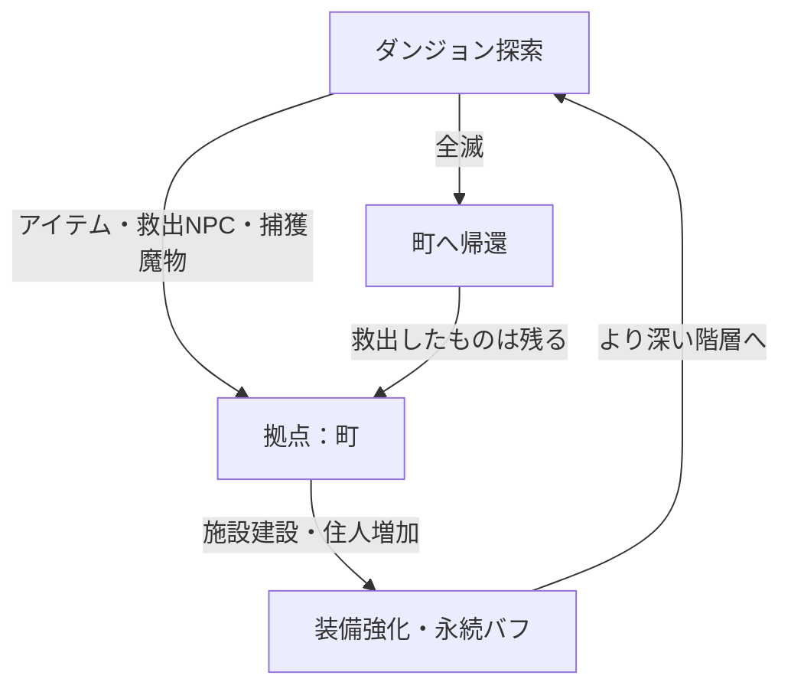

# ゲーム企画書：(タイトル未定) — 町作り×2Dローグライク

## 1. コンセプト・概要
**「ダンジョンから持ち帰ったすべてが、町の力になる。」**

不思議のダンジョン風のターン制探索と、拠点となる町を少しずつ作り上げていく育成要素を組み合わせた、スマホ向け一人用ローグライトゲームです。

- **ジャンル**: 町育成ローグライト（ターン制ダンジョン探索）
- **ターゲット**: 自分のペースでコツコツと進行を楽しみたい一人用ゲーム愛好家
- **プラットフォーム**: スマートフォン（横持ち画面）

## 2. メインループ

## 3. 町作りシステム（拠点発展）
プレイヤーはダンジョンから持ち帰った「素材」や「迷い込んだ人々」「魔物」を使って、廃れた町を再建します。

- **施設建設**:
    - **鍛冶屋**: 武器・防具の強化、合成。
    - **商店**: アイテムの売買。町の規模に合わせて品揃えが改善。
    - **宿屋**: スタミナ回復や、一時的なステータスアップを得る場所。
    - **魔物牧場**: ダンジョンで連れ戻した魔物を収容。
- **救出したNPC**: 町の住人となり、特定の施設に配置することでボーナスが発生します。
- **連れ戻した魔物**: 町の労働力（資源生産）として使うか、ダンジョンへ「ペット」として連れて行くかを選べます。

## 4. ダンジョンシステム
- **ターン制・シームレス戦闘**: プレイヤーが一歩行動すると敵も行動するシステム。「風来のシレン」のように、専用の戦闘画面には移行せず、マップ上でそのまま戦闘が行われます。
- **フロア生成**: 潜るたびに地形、落ちているアイテム、敵の配置が変わる自動生成マップ。
- **地形・ギミック**: 罠や、特定の素材が得られる採取ポイント、強力なボスが待ち構える階層。

## 5. 開発環境・ビジュアル・操作
- **開発環境**: Unity
- **ビジュアル（グラフィック）**: ドット絵ではなく、素材を活かした表現。（※要検討事項ではあるが）拠点の町は「完全な2D」、探索するダンジョン内は「2Dと3Dを交えた表現（例：背景が3Dでキャラクターが2Dなど）」を想定。
- **画面構成**: スマホ横画面。中央にメイン画面、左右や下部にコマンドボタンなどを配置。
- **操作**: 十字キーUIまたはタップ移動を選択可能にする。

---

## 検討中事項（オープンな質問）

- **タイトル案**:
    1. 『迷宮の村：再建記』
    2. 『ダンジョン・タウン・クロニクル』
    3. 『お持ち帰り！不思議のダンジョン』
- **魔物の役割**: 捕まえた魔物は「町限定の労働力」にするか、それとも「ダンジョンでの共闘」をメインにするか。
- **空腹度システム**: 不思議のダンジョンおなじみの「満腹度」は入れるべきか、それとも町の発展に集中できるよう廃止するか。
