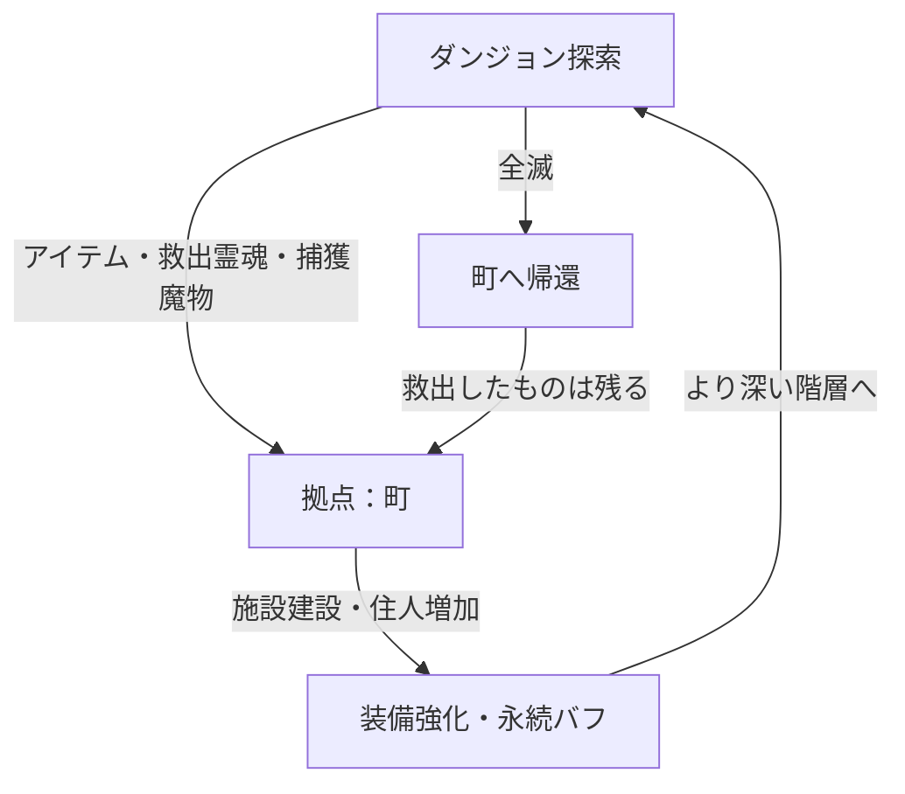

# ゲーム概要と機能一覧：(タイトル未定) — 町作り×2Dローグライク

> **このドキュメントは `GDD.md`（ゲーム企画書）と `機能一覧.md`（要件定義インデックス）を統合したものです。**

---

## 1. コンセプト・概要

**「ダンジョンから持ち帰ったすべてが、町の力になる。」**

不思議のダンジョン風のターン制探索と、拠点となる町を少しずつ作り上げていく育成要素を組み合わせた、スマホ向け一人用ローグライトゲームです。

| 項目 | 内容 |
|---|---|
| **ジャンル** | 町育成ローグライト（ターン制ダンジョン探索） |
| **ターゲット** | 自分のペースでコツコツと進行を楽しみたい一人用ゲーム愛好家 |
| **プラットフォーム** | スマートフォン（横持ち画面） |

---

## 2. メインループ

---

## 3. 町作りシステム（拠点発展）

プレイヤーはダンジョンから持ち帰った「素材」や「救出した霊魂」「魔物」を使って、廃れた拠点を再建・復興します。

### 施設一覧

| 施設名 | 役割 |
|---|---|
| **鍛冶屋** | 武器・防具の強化、合成（強化時にミニゲーム要素あり） |
| **商店** | アイテムの売買。町の規模に合わせて品揃えが改善 |
| **宿屋 / ギルド** | スタミナ回復やクエストの受注。特定のクエストで職業レベルの上限が解放 |
| **畑 / 釣り堀 / 牧場** | ダンジョン探索に必要な「食料（霊素）」を生産・獲得するスローライフ施設 |
| **魔物牧場** | ダンジョンで連れ戻した魔物を収容 |

### 住人・魔物

- **救出した霊魂たち**: 依り代となる鎧や人形に憑依して町の住人となり、特定の施設に配置することでボーナスが発生します。
- **連れ戻した魔物**: 町の労働力（資源生産）として使うか、ダンジョンへ「ペット」として連れて行くかを選べます。

### 必要な機能（要件）

- **施設管理機能**: ダンジョンでの戦略に直結するため、多種多様な施設を詳細仕様で定義する。
- **食料確保・スローライフシステム**: 畑での農作物育成、釣り堀での魚釣り、牧場でのモンスター飼育などを通じて食料を生産・獲得する。
- **資源・リソース管理**: ダンジョンから持ち帰った素材とお金の計算・保存。
- **恩恵（メタプログレッション）機能**: 町が発展することでプレイヤーに付与されるパッシブバフおよびスキル群。

---

## 4. ダンジョンシステム

### 設計方針

- **ターン制・シームレス戦闘**: プレイヤーが一歩行動すると敵も行動するシステム。「風来のシレン」のように、専用の戦闘画面には移行せず、マップ上でそのまま戦闘が行われます。
- **フロア生成**: 潜るたびに地形、落ちているアイテム、敵の配置が変わる自動生成マップ。
- **空腹度（霊素）システム**: ダンジョン内での無限稼ぎを防ぎ、現世に留まるエネルギーを管理するシステム。
- **地形・ギミック**: 罠や、特定の素材が得られる採取ポイント、強力なボスが待ち構える階層。

### 必要な機能（要件）

- **自動生成機能**: 部屋と通路の生成、階段の配置。
- **ギミック＆オブジェクト配置**: 罠、宝箱、回復の泉などの配置。
- **2D/3D描画システム**: 背景3D + キャラクター2Dビルボードのカメラ・描画制御。

---

## 5. ターン制・戦闘システム（機能要件）

- **ターン管理機能**: プレイヤーの行動（移動、攻撃、アイテム使用）に連動して敵が動く同期システム。
- **マップ上シームレス戦闘**: 画面遷移なしでのダメージ計算、攻撃アニメーション、ノックバック。
- **当たり判定・グリッド管理**: マス目（グリッド）ベースの移動と当たり判定システム。

---

## 6. ストーリー・進行システム（機能要件）

- **ゲームの話の流れ（シナリオ）**: オープニングからエンディング（あるいは周回）までのフロー。
- **ミッション・クエスト機能**: プレイヤーに短期・中期の目標を与える機能。特定クエスト達成が「職業レベルアップ条件」や「上位職の解放」に繋がる仕組み。
- **報酬・モチベーションシステム**: ミッションクリア時の報酬や、プレイヤーを飽きさせないためのリワード設計。武器のレベルアップや報酬獲得に関わる「ミニゲーム」要素の導入。

---

## 7. アイテム・インベントリシステム（機能要件）

- **インベントリ（持ち物）管理**: アイテムの取得、破棄、並び替え、持てる数の制限。
- **アイテム効果システム**: 回復、攻撃（巻物など）、装備品のステータス反映、未鑑定アイテムの処理。霊素（スタミナ）を満たす食料アイテムの処理。
- **武具強化・合成機能**: 町の施設（鍛冶屋など）で行うアイテム強化処理。強化時にミニゲームを挟み、結果によってボーナスが付く仕組み。

---

## 8. 職業（ジョブ）・ビルド構築システム（機能要件）

- **基本職・上級職の管理**: 戦士、魔法使いなどの基本職から、上位の職業へ転職するシステム（ドラクエ風）。転職やレベル上限解放には特定のクエスト達成や試練が必要。
- **スキル・魔法習得システム**: 職業ごとに異なる魔法やパッシブスキルの習得・リセット機能。
- **ビルド（構成）シナジー**: 職業スキル×装備×持ち込みアイテムの組み合わせによるシナジー効果の計算。

---

## 9. キャラクター管理システム（機能要件）

- **プレイヤーステータス管理**: HP、MP、攻撃力、防御力、レベル計算。加えてダンジョン内での「空腹度（霊素の残量）」を管理し、無限稼ぎを制限する。
- **エネミー（敵）AI**: プレイヤーの追跡（経路探索）、逃走、待機、固有の攻撃パターンの計算。
- **霊魂・魔物連れ帰り機能**: ダンジョン内で話しかける・救出・捕獲した対象を拠点に登録する処理。同行（ペット）や牧場での飼育に繋がる機能。同行時のAI。

---

## 10. UIシステム（機能要件）

| UIカテゴリ | 主な要素 |
|---|---|
| **ダンジョン・バトルUI** | ミニマップ、HP/スタミナバー、テキストログ、ステータス異常アイコン |
| **インベントリ・編成UI** | 持ち物一覧、装備の着脱、アイテム詳細確認、ソート機能 |
| **拠点・施設UI** | 施設の建築/アップグレード画面、魔物や霊魂たちの管理画面 |
| **シナリオ・テキストUI** | キャラクターの会話ウィンドウ、クエスト/ミッションの受注・報告画面 |
| **システムUI** | タイトル画面、リザルト画面、セーブ・ロード、設定画面 |

---

## 11. ミニゲームシステム（機能要件）

- **釣り堀・農業ミニゲーム**: 単なる待機にならないよう、アクションやパズルを通して食料やアイテムを獲得。
- **鍛冶屋ミニゲーム**: 武器・防具の強化結果に影響を与えるアクションゲーム。
- **ギャンブル・運試し**: 余剰資金を消費してアイテムを得るミニゲーム。
- **UIとの連携**: ミニゲーム専用の画面遷移やスコア表示の仕組み。

---

## 12. 開発環境・ビジュアル・操作

- **開発環境**: Unity
- **ビジュアル（グラフィック）**: ドット絵ではなく、素材を活かした表現。拠点の町は「完全な2D」、探索するダンジョン内は「2Dと3Dを交えた表現（例：背景が3Dでキャラクターが2Dなど）」を想定。
- **画面構成**: スマホ横画面。中央にメイン画面、左右や下部にコマンドボタンなどを配置。
- **操作**: 十字キーUIまたはタップ移動を選択可能にする。

---

## 13. 検討中事項（オープンな質問）

- **タイトル案**:
    1. 『迷宮の村：再建記』
    2. 『ダンジョン・タウン・クロニクル』
    3. 『お持ち帰り！不思議のダンジョン』
- **魔物の役割**: 捕まえた魔物は「町限定の労働力」にするか、それとも「ダンジョンでの共闘」をメインにするか。
- **職業・クラスシステム**: どの程度のバリエーションを持たせるか。上級職への転職条件のバランス調整。

---

## 詳細仕様ファイルのインデックス

> このドキュメントをベースに、各システムの詳細仕様を別ファイルに分けて記述していきます。

| ファイル名 | 対応セクション |
|---|---|
| `01_ストーリーと進行.md` | セクション 6（ストーリー・進行システム） |
| `02_ダンジョンシステム.md` | セクション 4・5（ダンジョン／戦闘） |
| `03_アイテムとインベントリ.md` | セクション 7（アイテム・インベントリ） |
| `04_町システム.md` | セクション 3（町作りシステム） |
| `05_職業システム.md` | セクション 8（ジョブ・ビルド） |
| `06_UIシステム.md` | セクション 10（UI） |
| `07_キャラクター管理システム\概要書.md` | セクション 9（キャラクター管理） |
| `08_ミニゲームシステム.md` | セクション 11（ミニゲーム） |
